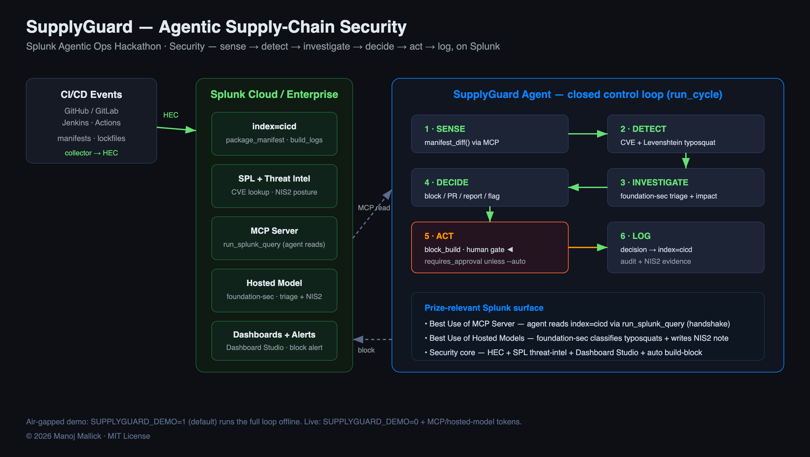

# SupplyGuard — Agentic Software Supply-Chain Security on Splunk

<p>
  
  
  
  
  
  
  
  
</p>

> **Splunk Agentic Ops Hackathon · Security track**
> *Your CI/CD pipeline added a backdoor last Tuesday. Splunk caught it — and blocked the build.*

Supply-chain attacks (XZ Utils, SolarWinds, Log4Shell) enter through the same
door: a dependency that wasn't there before, or one that silently changed. Most
security teams monitor network traffic; almost none monitor their **build
pipeline** in real time.

**SupplyGuard** ingests CI/CD events into Splunk, then runs an **agent** that
closes the loop: it senses new/changed dependencies, detects CVEs and
typosquatting, triages with a Splunk hosted security model, and **blocks the
build** — generating an NIS2 Article 21 evidence trail as it goes.

---

## Why this is *agentic ops*, not a CI lint step



```
   CI/CD events                ┌──────────────── SupplyGuard Agent ───────────────┐
 (GitHub/GitLab/Jenkins)       │ 1. SENSE       manifest diff ← Splunk MCP Server │
        │ HEC                  │ 2. DETECT      CVE + typosquat (real edit dist)  │
        ▼                      │ 3. INVESTIGATE Foundation-sec triage + impact    │
   index=cicd ───────────────► │ 4. DECIDE      block / PR / report / flag        │
        │ SPL                  │ 5. ACT         ► human-approval gate ◄           │
        ▼                      │ 6. LOG         decision → index=cicd (NIS2 trail)│
 Dashboards / Alerts          └──────────────────────────────────────────────────┘
```

| Capability | Where | Prize relevance |
|---|---|---|
| **Splunk MCP Server** | `mcp_client.py` — agent reads CI/CD via `run_splunk_query` (with the `initialize` handshake) | *Best Use of Splunk MCP Server* |
| **Splunk Hosted Models** | `judge.py` — `foundation-sec-1.1-8b-instruct` classifies typosquats + writes the NIS2 note | *Best Use of Splunk Hosted Models* |
| **HEC + SPL** | `collector.py`, `spl/` — ingestion + analytics (no `levenshtein`, no `join`) | Security core |
| **Approval gate** | `actions.py` — a hard build-block needs a human unless `--auto` | Responsible automation |

---

## Run it (zero network, ~2 seconds)

```bash
cd supplyguard
python demo.py          # human-approval gate ON  → block staged
python demo.py --auto   # autonomous             → build blocked
```

The demo senses build `payment-service#1247`, which added `reqursts@2.1.3`
(edit-distance 1 from `requests`) and `log4j-core@2.14.0` (CVE-2021-44228,
CVSS 10.0). Watch it sense → detect → triage → decide → act → log. No Splunk
instance or API key required (`SUPPLYGUARD_DEMO=1` is the default).

### Against a live Splunk instance

```bash
export SUPPLYGUARD_DEMO=0
export SPLUNK_HEC_URL=...   SPLUNK_HEC_TOKEN=...
# Splunk Cloud MCP endpoint (token audience must be 'mcp'):
export SPLUNK_MCP_URL=https://<deployment>.api.scs.splunk.com/<deployment>/mcp/v1/
export SPLUNK_MCP_TOKEN=...
export SPLUNK_HOSTED_MODEL=foundation-sec-1.1-8b-instruct
pip install -r requirements.txt
python demo.py --auto
```

Secrets come **only** from the environment — never hardcoded, always masked in
logs (`Config.mask_token`).

---

## What changed from the original plan

The first draft *claimed* AI but shipped SPL + a fake `levenshtein()`. This build
fixes that:

- **Genuinely agentic** — a real SENSE→…→ACT control loop (`agent.py`), not a one-shot script.
- **The AI is real** — a Splunk hosted security model classifies threats and writes the NIS2 narrative (`judge.py`), instead of a hardcoded `return 0.7`.
- **Correct Splunk surface** — reads via the MCP Server `run_splunk_query` tool with the streamable-HTTP `initialize` handshake.
- **SPL bugs fixed** — `levenshtein()` (not a native SPL function) is computed in Python; the `join` anti-pattern is replaced with `lookup`/`stats`.
- **No hardcoded secrets** — env-only, masked, air-gapped demo.

## Repository layout

```
supplyguard/
├── supplyguard/
│   ├── config.py        env-only secrets, risk thresholds, demo mode
│   ├── collector.py     CI/CD events → HEC (privacy-safe)
│   ├── mcp_client.py    Splunk MCP Server client (handshake) — agent reads Splunk
│   ├── analyzer.py      CVE lookup + real Levenshtein typosquat detection
│   ├── judge.py         Foundation-sec hosted model: triage + NIS2 narrative
│   ├── actions.py       block / PR / report / flag (+ approval gate)
│   └── agent.py         the agentic loop  ← the core
├── demo.py              runnable end-to-end demo (no network)
└── spl/                 SPL analytics + NIS2 posture queries
```

*© 2026 Manoj Mallick · MIT License*
